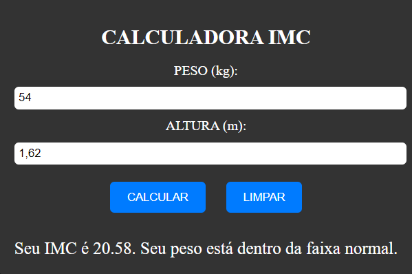

# CALCULAR IMC
🆎CALCULADORA DE IMC EM HTML, CSS E JS.

 <br>

## DESCRIÇÃO:
A "Calculadora IMC" é uma aplicação que permite calcular o Índice de Massa Corporal (IMC) com base no peso e altura fornecidos. Abaixo estão os principais recursos implementados:

1. Calcular IMC:
   - Ao clicar no botão "CALCULAR", o sistema calcula o IMC com base no peso (em quilogramas) e altura (em metros) inseridos.
   - O resultado do IMC é exibido abaixo do botão de cálculo.

2. Avaliar Situação:
   - Com base no IMC calculado, a aplicação fornece uma avaliação da situação do usuário em relação ao seu peso, indicando se está abaixo do peso, dentro da faixa normal, com sobrepeso ou em diferentes graus de obesidade.

   - Abaixo está a tabela que descreve os intervalos de IMC e suas respectivas situações:

   | Intervalo de IMC | Situação             |
   |------------------|----------------------|
   | Menor que 18.5   | Abaixo do peso       |
   | 18.5 - 24.9      | Peso normal          |
   | 25.0 - 29.9      | Sobrepeso            |
   | 30.0 - 34.9      | Obesidade grau I     |
   | 35.0 - 39.9      | Obesidade grau II    |
   | Maior ou igual a 40 | Obesidade grau III |

   - Essa tabela fornece uma orientação sobre a interpretação do IMC e a respectiva situação de saúde associada a cada faixa de valor.

3. Limpar Campos:
   - Ao clicar no botão "LIMPAR", todos os campos de entrada são resetados, incluindo o peso, altura e o resultado do cálculo do IMC.

## COMO USAR?
### BAIXANDO O PROJETO:
* Clone o repositório para o seu sistema local:

```bash
git clone https://github.com/VILHALVA/CALCULAR-IMC.git
```

* Navegue até o diretório do projeto.

```bash
cd CALCULAR-IMC
```

* Descompacte o arquivo ZIP (se você baixou manualmente):

```bash
unzip CALCULAR-IMC.zip
```

* Abra o arquivo `CODIGO.html` em seu navegador de preferência.

### EXECUTANDO O PROJETO:
1. Informar Peso e Altura:
   - Insira o seu peso em quilogramas no campo "PESO".
   - Insira a sua altura em metros no campo "ALTURA".

2. Calcular IMC:
   - Após inserir o peso e altura, clique no botão "CALCULAR" para calcular o seu IMC.

3. Avaliar Situação:
   - O sistema fornecerá uma avaliação da sua situação com base no IMC calculado.

4. Limpar Campos:
   - Se desejar limpar os campos e o resultado do cálculo, clique no botão "LIMPAR". Isso restaurará os campos para seus valores padrão e limpará o resultado do cálculo do IMC.

## NÃO SABE?
- Entendemos que para manipular arquivos em `HTML`, `CSS` e outras linguagens relacionadas, é necessário possuir conhecimento nessas áreas. Para auxiliar nesse aprendizado, oferecemos cursos gratuitos disponíveis:
* [Curso de HTML e CSS](https://github.com/VILHALVA/CURSO-DE-HTML-E-CSS)
* [Curso de JavaScript](https://github.com/VILHALVA/CURSO-DE-JAVASCRIPT)
* [Confira mais cursos](https://github.com/VILHALVA?tab=repositories&q=+topic:CURSO)

## CREDITOS:
- [PROJETO CRIADO PELO VILHALVA](https://github.com/VILHALVA)
- [ESTÁ DISPONIVEL NO SITE](https://vilhalva.github.io/STYLER/STYLER.html)

